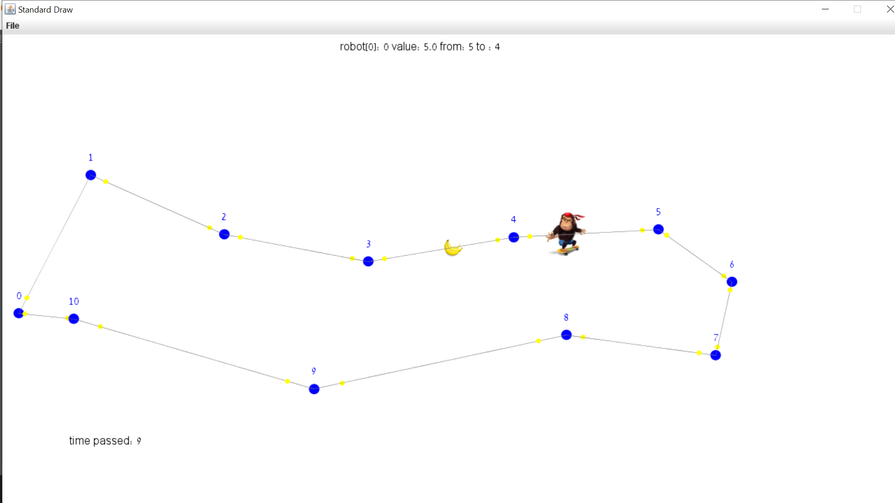

# FruitRobot
In this task, we build a robot maze game.
there is 23 cases of game.
Each game have 1 of 5 kinds of maps, diffrent number of robots & fruits.
the porpuse is to get the max points by collect fruits (each fruit equal other diffrent score).
the time of the game is 30 or 60 seconds.
the robots moves on edges of graph. when one of the robots pass by any fruits, the fruit is lost, and shown on other random edge.
each robot has a score of himself. 
the total game score is the sum up of all robots score.

good luck & enjoy playing.

